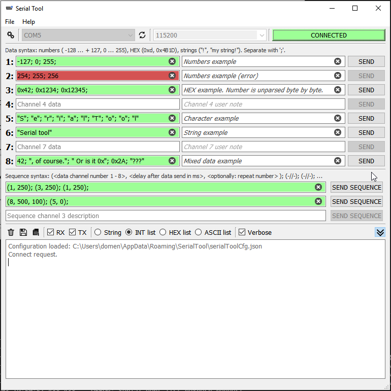
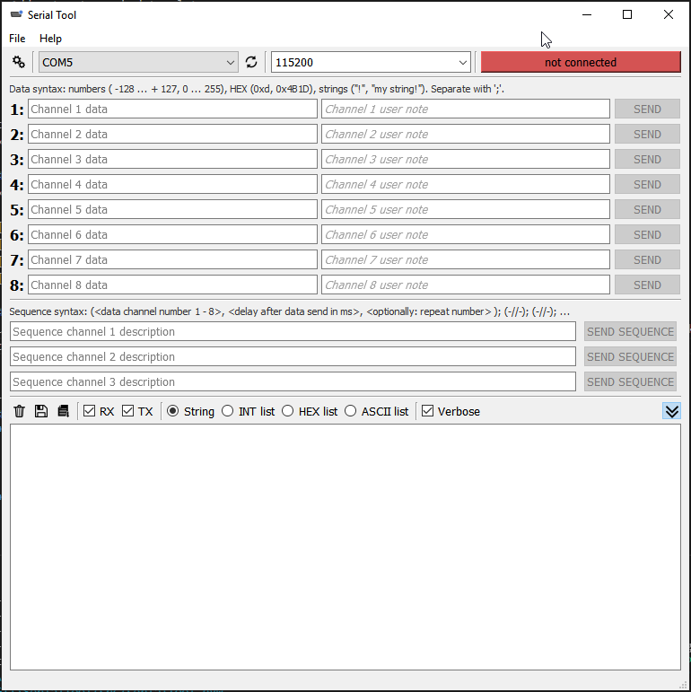
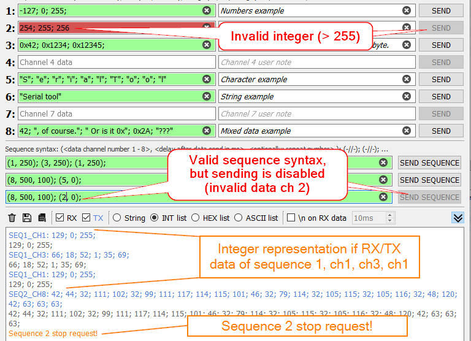
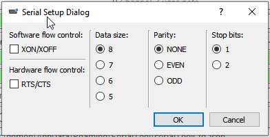
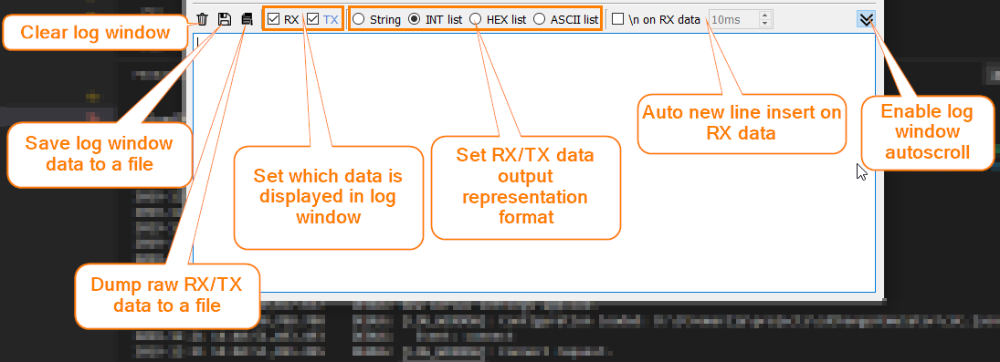
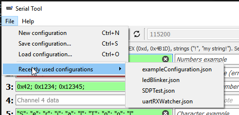

# Serial Tool
Serial Tool is a utility for developing, debugging and validating serial communication with PC.  
Great for data verification, custom protocols for embedded systems and other simple projects that include serial 
communication such as UART or RS232 (with appropriate hardware, like USB to UART converter and common FTDI chips).  

Original project: [https://damogranlabs.com/2022/12/serial-tool-v3/](https://damogranlabs.com/2022/12/serial-tool-v3/)

  
## Features
* View/rx/tx data types: integers, HEX numbers, ASCII characters, strings.
* Data/sequence field verification on the fly.
* User notes for each data channel.
* Sequence generator: create multiple blocks of (data channel, delay, repeat number) sequence.
* Asynchronous read of any received data.
* Log window display customization.
* Log window/raw data export capability.
* Save/load current settings to a configuration file.
  
# Installation And Usage
Use isolated virtual environment for these commands. If you are not sure what this is, see [here](https://docs.python.org/3/library/venv.html#:~:text=A%20virtual%20environment%20is%20created,the%20virtual%20environment%20are%20available.).
## Directly from GitHub
```
$ python -m pip install serial_tool@git+https://github.com/damogranlabs/serial-tool
```
Run the tool with:
```
python -m serial_tool
```

## Via `pipx`
```
pipx install git+https://github.com/damogranlabs/serial-tool
```
Run the tool with just:
```
serial_tool
```

### Usage FAQ:
1. Explore options with `-h` command line switch.
2. `serial_tool` vs `serial_tool_cmd`?  
    `serial_tool_cmd` is the same as `serial_tool`, but it prints std out/err to console.

# Screenshots
New, default blank configuration:  
  
Example configuration and explanation of data/sequence field validator:  
  
Serial port settings, which are also a part of configuration file settings:  
  
Log/save/export window settings:  
  
Configurations can be stored and recalled:  
  


Want to contribute? See [CONTRIBUTE.md](https://github.com/damogranlabs/serial-tool/blob/master/CONTRIBUTE.md).
